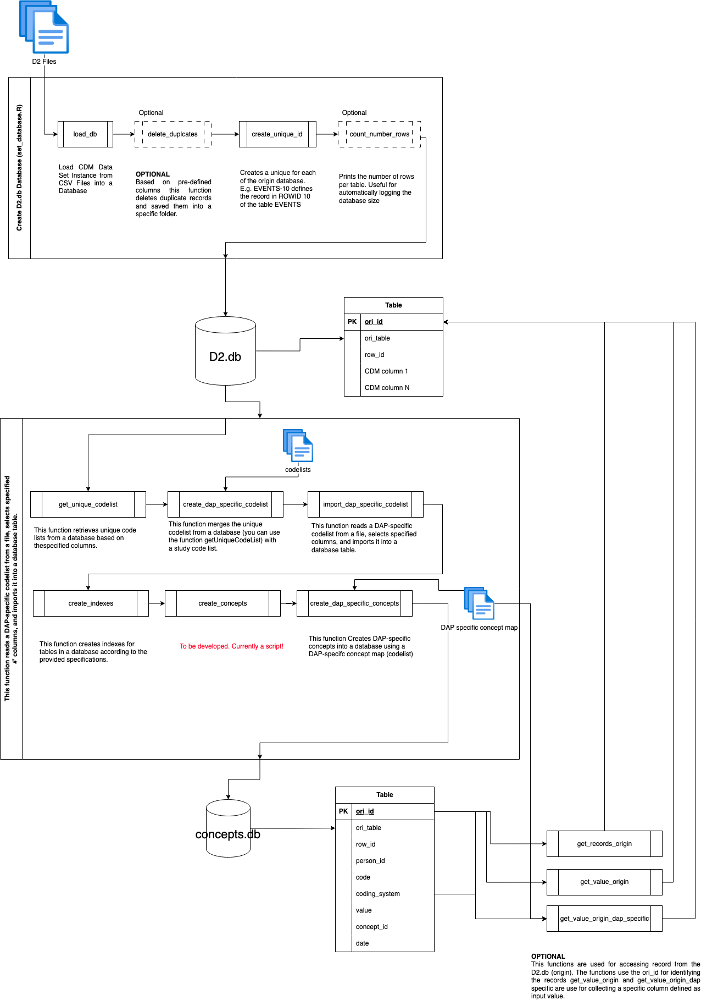

# RWE-DataManagementModel

<!-- badges: start -->
<!-- badges: end -->

RWE-DataManagementModel is an R package that provides a data model and functionality for processing RWD.



## Installation

You can install the development version of RWE-DataManagementModel (or the latest stable release) like so:

Using devtools (recommended):

Download and unzip (in your working enviroment) or clone the repo. Let's say your folder is here:

- on Mac, the *"path_to_the_directory_of_the_package"* looks something like this: "/Users/Name/Desktop/RWE-DataManagementModel"
- on Windows, the *"path_to_the_directory_of_the_package"* looks something like this: "C:/Users/Name/Desktop/RWE-DataManagementModel" (it should be **"/"**, and not "\\")

and on R console, type the following:
``` r
# If you don't have devtools, install it
install.packages("devtools")
#Install RWE-DataManagementModel  by typing this on R console
devtools::install("path_to_the_directory_of_the_package", dependencies = TRUE)
```
If it asks about updating the packages that are available in your system, I usually skip it and hope that I won't break anything. So far it worked, but please check it.

### Dependency `data.table` on mac

While the `data.table` library should install automatically upon installation of the package, it may not function optimally through this installation process when installed on a mac (which will be the case for most users of this package).
It is recommended to take a look at the [Mac-specific installation instructions](https://github.com/Rdatatable/data.table/wiki/Installation#Enable-openmp-for-macos) for `data.table` and OpenMP support, as well as [this issue](https://github.com/Rdatatable/data.table/issues/5419) with a detailed workaround for M1/2 chips.

You can verify `data.table` functionality with:
```
data.table::test.data.table()
```

## Example

Here is how you can use metadatachecker: 


On R console, type the following:
``` r
library(RWE-DataManagementModel)
```
